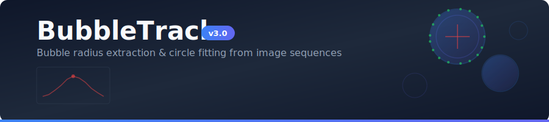
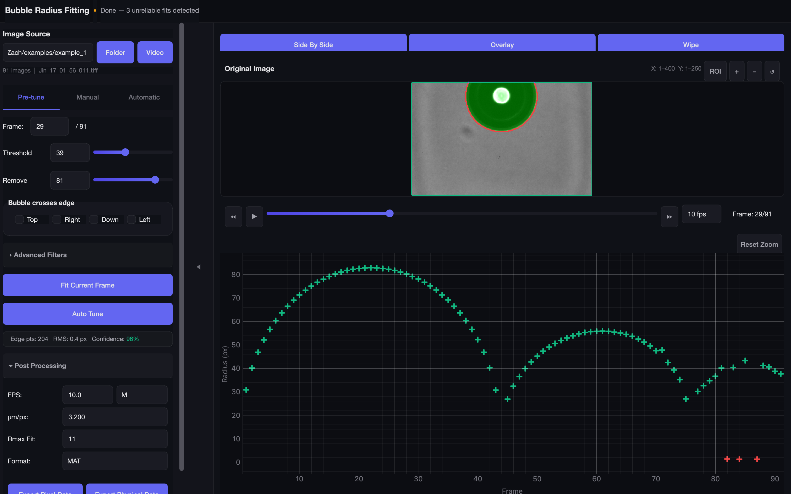
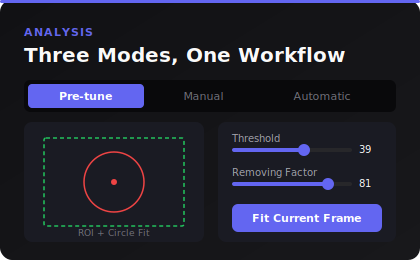
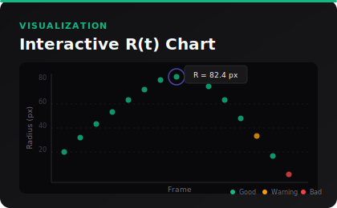
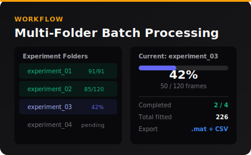
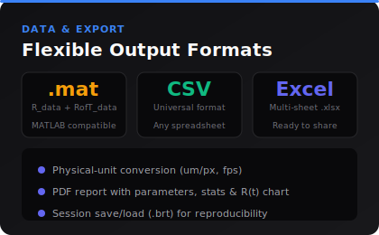

<p align="center">
  
</p>

<p align="center">
  <a href="https://github.com/zachtong/Bubble-Radius-Fitting/releases"></a>
  
  
  
  
</p>

<p align="center">
  Desktop application for extracting bubble radius vs. time data from image sequences.<br/>
  Detects bubble boundaries via adaptive thresholding and morphological filtering, then fits circles using the Taubin algebraic method.
</p>

---

## Download

Pre-built executables — no Python installation required:

| Platform | Download | Instructions |
|:--------:|:---------|:-------------|
| **Windows** | [`BubbleTrack-Windows.exe`](https://github.com/zachtong/Bubble-Radius-Fitting/releases/latest) | Double-click to run |
| **macOS** | [`BubbleTrack-macOS.zip`](https://github.com/zachtong/Bubble-Radius-Fitting/releases/latest) | Unzip, open `BubbleTrack.app` |

> **First time on macOS?** If you see "unidentified developer", right-click the app and choose *Open*.

---

## Screenshots

<!-- Replace with your own screenshot: open the app, take a full-window capture, save as docs/screenshot.png -->
<p align="center">
  
</p>

---

## Features

<p align="center">
  <a href="docs/v3-highlights.html"></a>
</p>

<p align="center">
  
  
</p>
<p align="center">
  
  
</p>

---

## Quick Start

### From Release (Recommended)

Download from the [Releases](https://github.com/zachtong/Bubble-Radius-Fitting/releases) page and run directly.

### From Source

```bash
git clone https://github.com/zachtong/Bubble-Radius-Fitting.git
cd Bubble-Radius-Fitting
```

| Platform | Setup | Launch |
|----------|-------|--------|
| **Windows** | `setup.bat` | `BubbleTrack.bat` |
| **macOS** | `bash setup.sh` | `bash bubbletrack.sh` |

### Workflow

1. **Open** — Browse to select a folder of images (TIFF, PNG, JPG, BMP) or a video file
2. **Pre-tune** — Drag ROI, adjust Threshold & Removing Factor, click *Fit Current Frame*
3. **Automatic** — Set frame range, click *Run All* for batch processing
4. **Export** — Save results as `.mat`, CSV, or Excel from Post Processing

---

## Parameter Guide

| Parameter | Effect |
|-----------|--------|
| **Threshold** | Adaptive binarisation sensitivity. Higher = more white pixels |
| **Removing Factor** | Remove small white speckles. Higher = removes larger noise |
| **Gaussian Blur** | Smooth greyscale image before binarisation |
| **CLAHE** | Adaptive histogram equalisation for uneven lighting |
| **Morph Close** | Fill small holes and gaps inside the bubble boundary |
| **Morph Open** | Remove thin protrusions on the bubble edge |
| **Max Radius** | Cap fitted radius to reject false detections |
| **Edge flags** | Handle bubbles extending beyond the ROI boundary |

---

## Algorithm

```
Greyscale Image
    |
    v
[Gaussian Blur] --> [CLAHE] --> Adaptive Binarisation
                                      |
                                      v
                              Small Object Removal
                                      |
                                      v
                              Boundary Expansion (partial bubbles)
                                      |
                                      v
                          Morphological Open / Close
                                      |
                                      v
                              Blob Selection (largest, non-elongated)
                                      |
                                      v
                              Edge Detection (morphological gradient)
                                      |
                                      v
                              Taubin Circle Fit --> R(t)
                                      |
                                      v
                              Rmax Quadratic Interpolation
```

---

## Project Structure

```
src/bubbletrack/
├── app.py                  # GUI entry point
├── cli.py                  # CLI entry point
├── model/                  # Core algorithms (no GUI dependency)
│   ├── detection.py        #   Bubble boundary detection pipeline
│   ├── circle_fit.py       #   Taubin circle fitting
│   ├── export.py           #   .mat / CSV / Excel export
│   ├── autotune.py         #   Auto-parameter optimisation
│   └── quality.py          #   Fit quality scoring
├── controller/             # MVC controllers
│   ├── controller.py       #   Main controller (signal wiring)
│   ├── worker.py           #   Background frame processing
│   └── batch_folder_worker.py  # Multi-folder batch worker
├── ui/                     # PyQt6 widgets
│   ├── main_window.py      #   3-panel dark-theme layout
│   ├── image_panel.py      #   QGraphicsView with overlays
│   └── radius_chart.py     #   pyqtgraph R(t) scatter chart
└── resources/
    ├── style.qss           # Dark-theme stylesheet
    └── icon.ico            # Application icon
```

---

## Building from Source

| Platform | Command | Output |
|----------|---------|--------|
| **Windows** | `build_app.bat` | `dist\BubbleTrack.exe` |
| **macOS** | `bash build_app.sh` | `dist/BubbleTrack.app` |

## Running Tests

```bash
pip install -e ".[dev]"
pytest -v
```

---

## Reference

> G. Taubin, "Estimation of Planar Curves, Surfaces and Nonplanar Space Curves Defined by Implicit Equations, with Applications to Edge and Range Image Segmentation", *IEEE Trans. PAMI*, Vol. 13, pp. 1115-1138, 1991.

## Author

**Zixiang (Zach) Tong** — The University of Texas at Austin

## License

For academic and research use.
